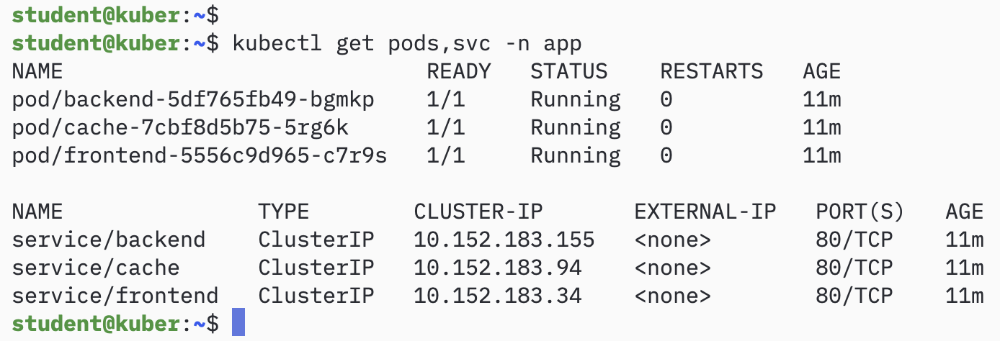
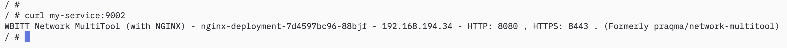
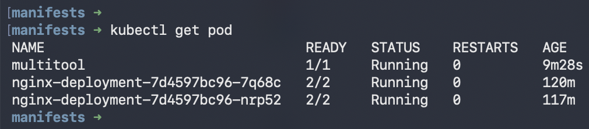
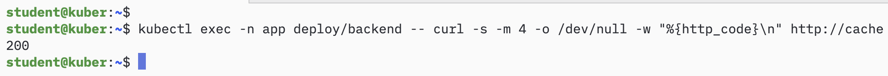
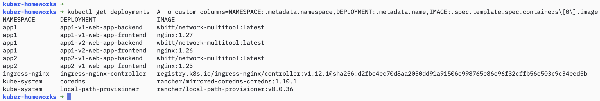
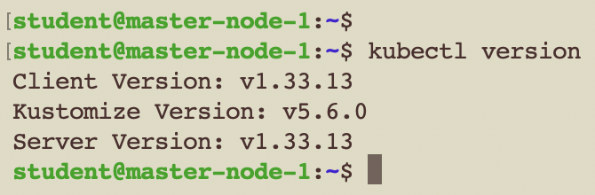
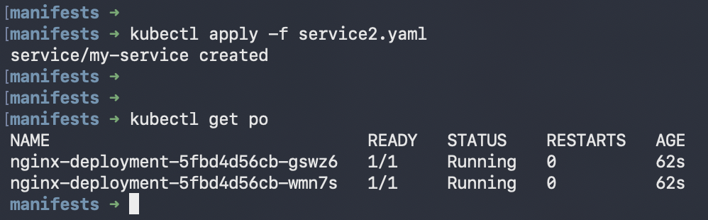

# Домашнее задание к занятию «Как работает сеть в K8s» - Муравский Артем

---

## Задание 1. Создать сетевую политику для обеспечения доступа

### Что было сделано

В namespace `app` развёрнуто три приложения: **frontend**, **backend** и **cache** — все на образе `network-multitool`, каждое со своим Service. Задача — настроить сетевые политики так, чтобы трафик шёл строго по цепочке **frontend → backend → cache**, а любые другие подключения оказались закрыты.

Чтобы добиться избирательного доступа, я пошёл от обратного: сначала закрыл всё по умолчанию, а затем точечно разрешил нужные направления. Для этого созданы три политики:

- `default-deny-all` — запрещает входящий трафик ко всем подам namespace по умолчанию;
- `backend-allow-frontend` — пускает к `backend` только поды `frontend`;
- `cache-allow-backend` — пускает к `cache` только поды `backend`.

Комбинация «базовый запрет + точечные разрешения» надёжно формирует требуемую цепочку: лишние подключения просто не имеют право на существование.

### Подготовка окружения

```bash
# создаём namespace
kubectl create ns app
```

### Деплоймент приложений и политик

```bash
kubectl apply -f manifests/namespace.yaml
kubectl apply -f manifests/deployment-frontend.yaml
kubectl apply -f manifests/deployment-backend.yaml
kubectl apply -f manifests/deployment-cache.yaml
kubectl apply -f manifests/service-frontend.yaml
kubectl apply -f manifests/service-backend.yaml
kubectl apply -f manifests/service-cache.yaml
kubectl apply -f manifests/networkpolicy-default-deny.yaml
kubectl apply -f manifests/networkpolicy-backend.yaml
kubectl apply -f manifests/networkpolicy-cache.yaml
```

### Результаты

**Поды и сервисы** — все три приложения в namespace `app` поднялись и готовы:

```
kubectl get pods,svc -n app -o wide
```



**Сетевые политики** — три политики на месте:

```
kubectl get networkpolicy -n app
```



### Проверка трафика

Трафик ходит по цепочке **frontend → backend → cache**. Проверил и разрешённые, и запрещённые направления — так нагляднее видно, что политики работают.

**frontend → backend — очередь открыта (HTTP 200):**
```bash
kubectl exec -n app deploy/frontend -- curl -s -m 4 -o /dev/null -w "%{http_code}\n" http://backend
```


**backend → cache — тоже должно работать (HTTP 200):**
```bash
kubectl exec -n app deploy/backend -- curl -s -m 4 -o /dev/null -w "%{http_code}\n" http://cache
```


**frontend → cache — в обход backend не получится (таймаут):**
```bash
kubectl exec -n app deploy/frontend -- curl -s -m 5 -o /dev/null -w "%{http_code}\n" http://cache
```


**cache → backend — обратно ходить запрещено (таймаут):**
```bash
kubectl exec -n app deploy/cache -- curl -s -m 5 -o /dev/null -w "%{http_code}\n" http://backend
```


**backend → frontend — тоже заблокировано (таймаут):**
```bash
kubectl exec -n app deploy/backend -- curl -s -m 5 -o /dev/null -w "%{http_code}\n" http://frontend
```


### Сводка

| Направление  | Ожидание   | Результат       |
|--------------|------------|-----------------|
| frontend → backend | разрешено | HTTP 200 |
| frontend → cache   | запрещено | timeout |
| backend → cache    | разрешено | HTTP 200 |
| cache → backend    | запрещено | timeout |
| cache → frontend   | запрещено | timeout |
| backend → frontend | запрещено | timeout |

Трафик идёт строго по цепочке `frontend → backend → cache`, всё остальное закрыто политиками.

---

## Манифесты

Все тексты манифестов лежат в папке [`manifests/`](manifests/):

- [`namespace.yaml`](manifests/namespace.yaml)
- [`deployment-frontend.yaml`](manifests/deployment-frontend.yaml)
- [`deployment-backend.yaml`](manifests/deployment-backend.yaml)
- [`deployment-cache.yaml`](manifests/deployment-cache.yaml)
- [`service-frontend.yaml`](manifests/service-frontend.yaml)
- [`service-backend.yaml`](manifests/service-backend.yaml)
- [`service-cache.yaml`](manifests/service-cache.yaml)
- [`networkpolicy-default-deny.yaml`](manifests/networkpolicy-default-deny.yaml)
- [`networkpolicy-backend.yaml`](manifests/networkpolicy-backend.yaml)
- [`networkpolicy-cache.yaml`](manifests/networkpolicy-cache.yaml)
