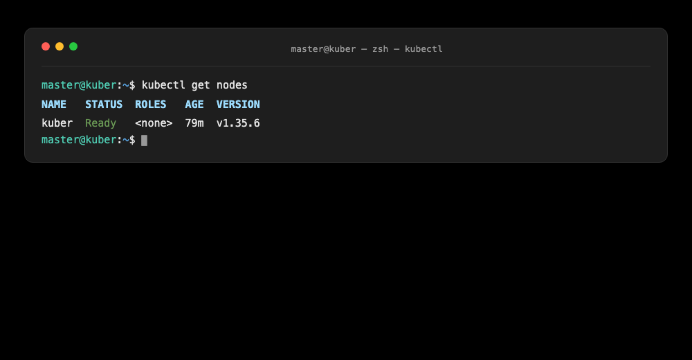
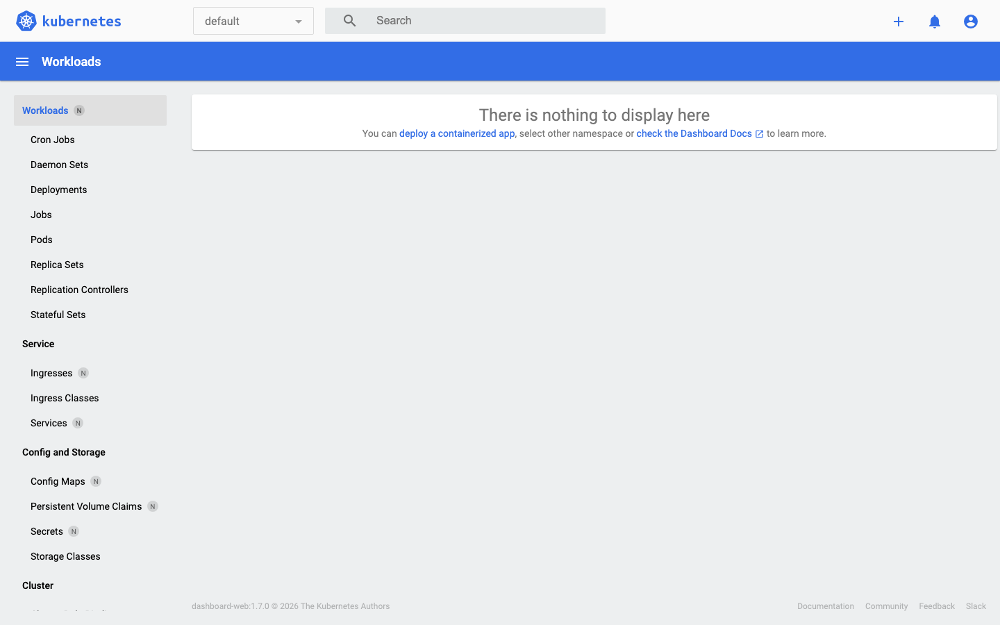

# Домашнее задание к занятию «Kubernetes. Причины появления. Команда kubectl» - Муравский Артем

## Задание 1. Установка MicroK8S

### 1.1 Установка MicroK8S

MicroK8S установлен на виртуальную машину `kuber` (Ubuntu 26.04 LTS, arm64) через OrbStack. Установка выполнялась по официальной инструкции:

```bash
sudo apt update
sudo apt install snapd
sudo snap install microk8s --classic
```

Локальный пользователь добавлен в группу `microk8s`, права на папку конфигурации настроены:

```bash
sudo usermod -a -G microk8s $USER
sudo chown -f -R $USER ~/.kube
```

Проверка статуса кластера:

```bash
microk8s status --wait-ready
```

```
microk8s is running
high-availability: no
  datastore master nodes: 127.0.0.1:19001
  datastore standby nodes: none
addons:
  enabled:
    dashboard
    dns
    ha-cluster
    helm
    helm3
    metrics-server
```

Версия кластера:

```bash
microk8s kubectl get nodes
```

```
NAME    STATUS   ROLES    AGE   VERSION
kuber   Ready    <none>   79m   v1.35.6
```

### 1.2 Установка dashboard

Dashboard включён через addon:

```bash
microk8s enable dashboard
```

Все поды дашборда в статусе `Running`:

```
NAME                                                    READY   STATUS    RESTARTS   AGE
kubernetes-dashboard-api-75778f6547-2f28q               1/1     Running   0          10m
kubernetes-dashboard-auth-7598ff7f-qz2mf                1/1     Running   0          10m
kubernetes-dashboard-kong-78b7499b45-wsttm              1/1     Running   0          10m
kubernetes-dashboard-metrics-scraper-594bbfb84b-g9hlf   1/1     Running   0          10m
kubernetes-dashboard-web-7f7574785f-tbkv6               1/1     Running   0          10m
```

### 1.3 Сертификат для подключения к внешнему IP-адресу

В файл `/var/snap/microk8s/current/certs/csr.conf.template` добавлен внешний IP-адрес виртуальной машины `192.168.139.27` (строка `IP.3` перед маркером `#MOREIPS`, который MicroK8s заменяет остальными IP узла при генерации):

```
[ alt_names ]
DNS.1 = kubernetes
DNS.2 = kubernetes.default
DNS.3 = kubernetes.default.svc
DNS.4 = kubernetes.default.svc.cluster
DNS.5 = kubernetes.default.svc.cluster.local
IP.1 = 127.0.0.1
IP.2 = 10.152.183.1
IP.3 = 192.168.139.27
#MOREIPS
```

Сертификаты перевыпущены:

```bash
sudo microk8s refresh-certs --cert server.crt
sudo microk8s refresh-certs --cert front-proxy-client.crt
```

`server.crt` обслуживает внешнее подключение к API-серверу (порт 16443), поэтому важен именно он; `front-proxy-client.crt` перевыпускается по инструкции к заданию.

Проверка, что сертификат сервера API содержит внешний IP в `Subject Alternative Name`:

```
X509v3 Subject Alternative Name:
    DNS:kubernetes, DNS:kubernetes.default, DNS:kubernetes.default.svc,
    DNS:kubernetes.default.svc.cluster, DNS:kubernetes.default.svc.cluster.local,
    IP Address:127.0.0.1, IP Address:10.152.183.1,
    IP Address:192.168.139.27, IP Address:192.168.139.27,
    IP Address:FD07:B51A:CC66:0:54BB:6FFF:FED3:1284
```

Внешний IP `192.168.139.27` указан дважды: добавлен вручную в шаблон (`IP.3`) и дополнительно подставлен MicroK8s автоматически вместо маркера `#MOREIPS` — дублирование SAN допустимо.

Подключение с рабочей машины к кластеру через внешний IP работает:

```bash
kubectl --kubeconfig ~/.kube/microk8s-dashboard.yaml get nodes
```

## Задание 2. Установка и настройка локального kubectl

### 2.1 Установка kubectl на локальную машину

kubectl установлен на рабочую машину (macOS, arm64):

```bash
curl -LO "https://dl.k8s.io/release/$(curl -L -s https://dl.k8s.io/release/stable.txt)/bin/darwin/arm64/kubectl"
chmod +x kubectl
sudo mv ./kubectl /usr/local/bin/kubectl
```

Версия клиента:

```bash
kubectl version --client
```

```
Client Version: v1.33.9
Kustomize Version: v5.6.0
```

Автодополнение kubectl в bash:

```bash
source <(kubectl completion bash)
echo "source <(kubectl completion bash)" >> ~/.bashrc
```

### 2.2 Настройка локального подключения к кластеру

Конфигурация подключения получена с кластера и сохранена локально:

```bash
microk8s config > ~/.kube/microk8s-dashboard.yaml
```

Проверка подключения к кластеру с рабочей машины:

```bash
kubectl --kubeconfig ~/.kube/microk8s-dashboard.yaml get nodes
```



Узел `kuber` доступен, статус `Ready`, версия кластера `v1.35.6`.

### 2.3 Подключение к дашборду с помощью port-forward

Проброс порта с виртуальной машины на хост:

```bash
microk8s kubectl port-forward -n kubernetes-dashboard service/kubernetes-dashboard-kong-proxy 10443:443 --address 0.0.0.0
```

Дашборд доступен в браузере на рабочей машине:

```
https://localhost:10443
```

Для входа создан служебный аккаунт с правами кластерного администратора:

```bash
microk8s kubectl create serviceaccount dash-admin -n kubernetes-dashboard
microk8s kubectl create clusterrolebinding dash-admin --clusterrole=cluster-admin --serviceaccount=kubernetes-dashboard:dash-admin
microk8s kubectl create token dash-admin -n kubernetes-dashboard
```

Скриншот дашборда:



Для сохранения проброса порта после перезагрузок виртуальной машины создан systemd-сервис `dashboard-proxy` (запускает `kubectl port-forward` с автоперезапуском).
