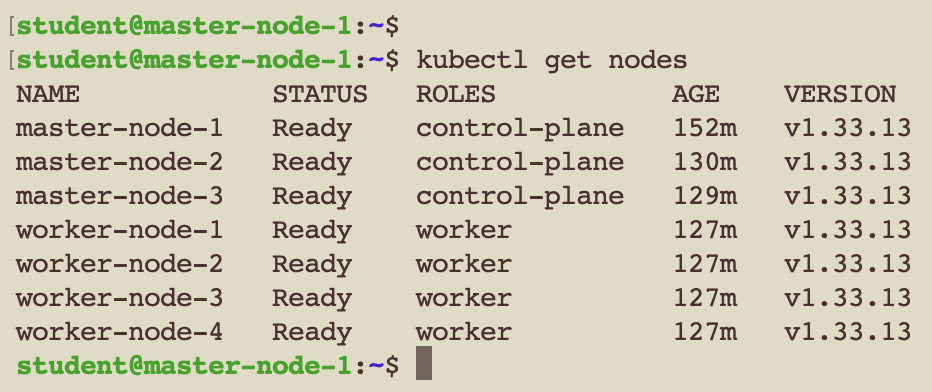
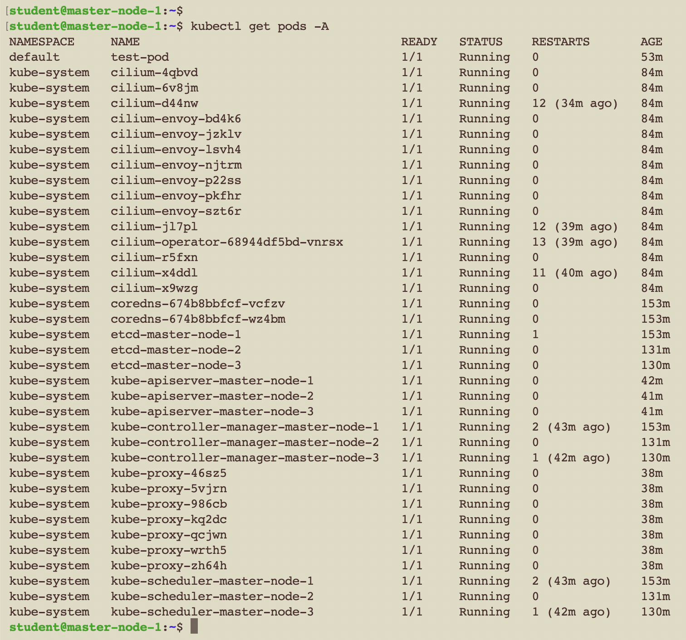
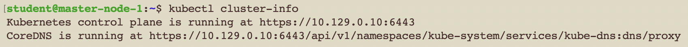
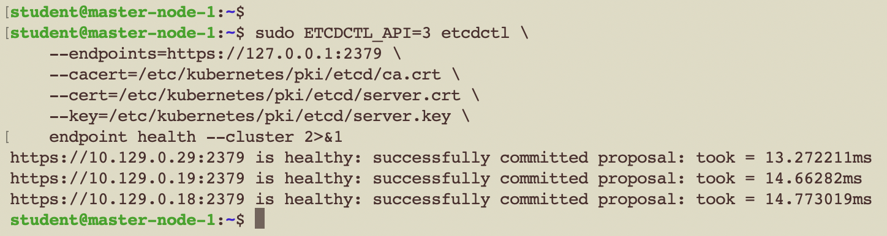
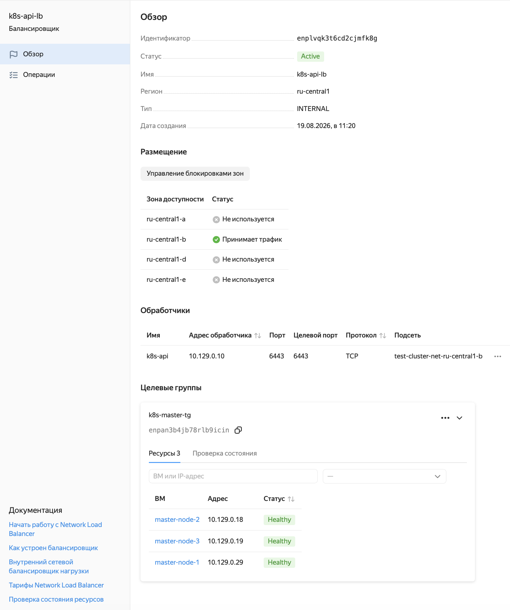

# Домашнее задание к занятию «Установка Kubernetes» - Муравский Артем

---

## Задание 1. Установить кластер k8s с 1 master node

### Что было сделано

Развёрнут кластер Kubernetes из 5 нод: 1 master + 4 worker. Все ноды — Ubuntu 24.04.4 LTS, CRI — containerd, CNI — Cilium. etcd работает на master-ноде в режиме stacked (standalone).

### Конфигурация кластера

| Параметр | Значение |
|----------|----------|
| Kubernetes | v1.33.13 |
| containerd | 2.2.1 |
| CNI | Cilium |
| etcd | stacked на master |
| Master | 1 (`master-node-1`) |
| Workers | 4 (`worker-node-1`..`worker-node-4`) |

### Результаты

**Виртуальные машины** для развертывания кластера в Яндекс Облаке


**Список нод** — все 5 нод в статусе `Ready`:


**Поды в кластере** — все 22 пода в `kube-system` в статусе `Running`, перезапусков 0:


**Информация о кластере** — control plane доступен по адресу `https://10.129.0.29:6443`:


**Версия Kubernetes** — сервер и клиент совпадают:


**etcd здоров** — `endpoint health` подтверждает работоспособность хранилища:


### Как воспроизвести

1. Подготовить 5 ВМ с Ubuntu 24.04 (1 master + 4 worker)
2. На всех нодах установить containerd, kubeadm, kubelet, kubectl
3. На master: `kubeadm init --pod-network-cidr=10.244.0.0/16`
4. Установить Cilium: `cilium install`
5. На worker-нодах: `kubeadm join` с токеном с master

---

## Задание 2*. Установить кластер HA k8s с 3 master node

### Что было сделано

Развёрнут кластер Kubernetes HA из 7 нод: 3 master + 4 worker. Все ноды — Ubuntu 24.04.4 LTS, CRI — containerd, CNI — Cilium. etcd работает в stacked режиме на 3 master-нодах. Control plane доступен через внутренний Network Load Balancer Яндекс Облака.

### Конфигурация кластера

| Параметр | Значение |
|----------|----------|
| Kubernetes | v1.33.13 |
| containerd | 2.2.1 |
| CNI | Cilium |
| etcd | stacked (3 ноды) |
| Masters | 3 (`master-node-1/2/3`) |
| Workers | 4 (`worker-node-1`..`worker-node-4`) |
| Control Plane Endpoint | `10.129.0.10:6443` (NLB) |

### Проблема и решение

При развёртывании HA-кластера в Яндекс Облаке обнаружена особенность платформы: прямое TCP-соединение к порту 6443 между VM блокируется на уровне VPC (ICMP и другие порты работают). keepalived также не работает (VRRP-мултикаст заблокирован, виртуальный MAC не поддерживается).

**Решение**: создан внутренний Network Load Balancer (NLB) с VIP `10.129.0.10:6443`, target group — 3 master-ноды. EndpointSlice kubernetes-сервиса настроен на NLB VIP, kube-proxy DNATит ClusterIP → NLB.

### Результаты

**Виртуальные машины** — 7 нод в Яндекс Облаке (3 master + 4 worker):


**Список нод** — все 7 нод в статусе `Ready`:



**Поды в кластере** — все поды в `kube-system` в статусе `Running`:



**Информация о кластере** — control plane через NLB:



**etcd кластер** — все 3 узла здоровы:



**Network Load Balancer** — внутренний NLB проксирует API-сервер:



### Как воспроизвести

1. Подготовить 7 ВМ с Ubuntu 24.04 (3 master + 4 worker) в одной подсети VPC
2. На всех нодах установить containerd, kubeadm, kubelet, kubectl
3. Создать внутренний Network Load Balancer с target group (3 master IP, порт 6443). VIP: `10.129.0.10`
4. На master-1 создать конфиг kubeadm:

```yaml
# kubeadm.yaml
apiVersion: kubeadm.k8s.io/v1beta4
kind: ClusterConfiguration
kubernetesVersion: v1.33.13
controlPlaneEndpoint: "10.129.0.10:6443"
networking:
  podSubnet: "10.244.0.0/16"
  serviceSubnet: "10.96.0.0/12"
apiServer:
  extraArgs:
    endpoint-reconciler-type: "none"
```

5. Инициализировать кластер: `kubeadm init --config kubeadm.yaml --upload-certs --ignore-preflight-errors=CRI`
6. Сразу пропатчить EndpointSlice на NLB VIP:

```bash
kubectl patch endpointslice kubernetes -n default --type=json \
  -p='[{"op":"replace","path":"/endpoints","value":[{"addresses":["10.129.0.10"],"conditions":{"ready":true}}]}]'
```

7. На master-2/3: `kubeadm join --control-plane ...`
8. На worker-нодах: `kubeadm join ...`
9. Установить Cilium: `cilium install`
10. Перезапустить kube-proxy: `kubectl rollout restart daemonset kube-proxy -n kube-system`
