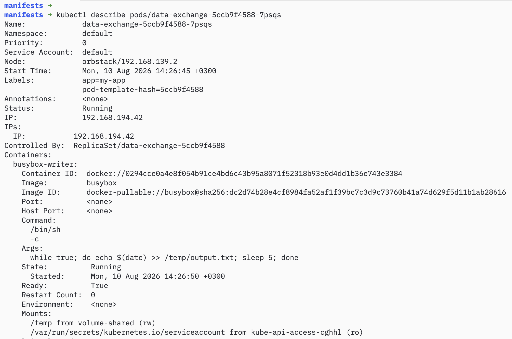
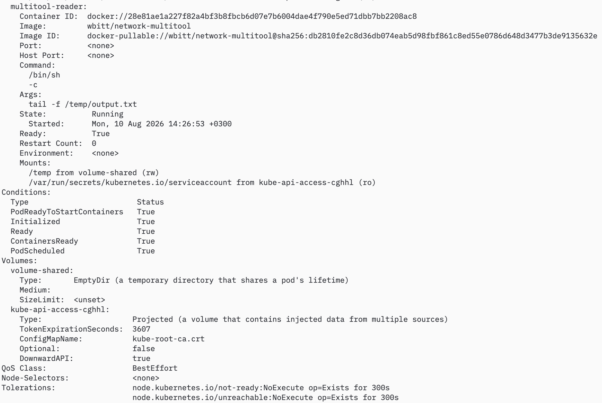
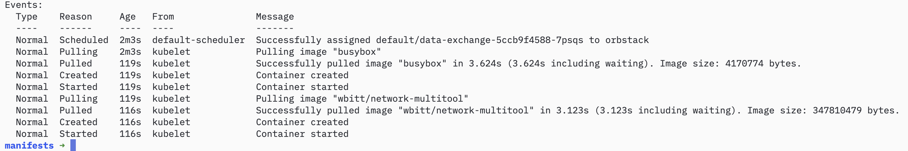

# Домашнее задание к занятию «Хранение в K8s» - Муравский Артем

## Задание 1

Создаем *deployment* из манифеста [containers-data-exchange.yaml](manifests/containers-data-exchange.yaml) командой `kubectl apply -f containers-data-exchange.yaml`

Выведем описание пода с контейнерами с помощью команды `kubectl describe pods/data-exchange-5ccb9f4588-7psqs`

Скриншоты результата выполнения команды

Проверяем, что контейнером *busybox-writer* осуществляется запись каждые 5 с в файл `/temp/output.txt` и этот файл можно прочитать контейнером *multitool-reader*, для этого выполняем команду `kubectl exec -it data-exchange-5ccb9f4588-7psqs -c multitool-reader -- tail -f /temp/output.txt`

Скриншот результата выполнения команды

---

## Задание 2

1. 2. Создаем *deployment*, *pv*, *pvc* из манифеста [pv-pvc.yaml](manifests/pv-pvc.yaml) командой `kubectl apply -f pv-pvc.yaml`

Проверяем наличие создавшихся *pv* и *pvc*, последовательно выполнив команды `kubectl get pv` и `kubectl get pvc`. Обращаем внимание, что у обоих объектов статус `Bound`

Скриншот результата выполнения команды

3. Проверяем, что контейнером *busybox-writer* осуществляется запись каждые 5 с в файл `/temp/output.txt` и этот файл можно прочитать контейнером *multitool-reader*, для этого выполняем команду `kubectl exec -it data-exchange-pvc-76bcbf449b-bdzz2 -c multitool-reader -- tail -f /temp/output.txt`

Скриншот результата выполнения команды

4. Удаляем *deployment* и *pvc* командами `kubectl delete deployment data-exchange-pvc` и `kubectl delete pvc netology-pvc` соответственно

Скриншот результата выполнения команд

Проверяем в каком состоянии находится *pv* с помощью команды `kubectl describe pv netology-pv`

Скриншот результата выполнения команды

В выводе можно увидеть, что у *pv* `ReclaimPolicy: Retain` и  `Status: Released`. Так как `ReclaimPolicy` имеет значение `Retain`, то Kubernetes не удаляет данные и *pv* остаётся в статусе `Released`, пока *pv* не освободят/не удалят вручную

5. Проверяем сохранился ли файл `output.txt`, в который записывал данные контейнер *busybox*.

  Примечание:
  *Так как в качестве кластера используется встроенный Kubernetes в OrbStack на macOS (k3s (Rancher) версии v1.35.6+orb1 на базе containerd), единственная нода orbstack (control-plane) работает внутри легковесной Linux-VM OrbStack, то напрямую на ноду подключиться по ssh нельзя и нужно использовать команду `kubectl debug node/orbstack -it --image=busybox -- sh`, которая в том числе монтирует корень файловой системы ноды /, в /host внутри пода*

Выполняем подключение на ноду и проверяем наличие файла `output.txt` с помощью команды `ls -la /host/temp/output.txt`

Скриншот результата выполнения команды

Удаляем *pv* с помощью команды `kubectl delete pv netology-pv`

Скриншот результата выполнения команды

Выполняем подключение на ноду и проверяем наличие файла `output.txt` с помощью команды `ls -la /host/temp/output.txt` и видим, что файл остался на файловой системе ноды (скриншот не приводится, так как полностью аналогичен скриншоту предыдущей проверке наличия файла). Это можно объяснить тем, что удаление *pv* удаляет только объект k8s, hostPath-данные на диске не управляются кластером и не удаляются.

---

## Задание 3

1. 2. Создаем *deployment*, *pv*, *pvc*, *sc* из манифеста [sc.yaml](manifests/sc.yaml) командой `kubectl apply -f sc.yaml`

Проверяем наличие создавшихся *sc* и *pvc*, выполнив команду `kubectl get sc,pvc`. Обращаем внимание, что у *pvc* у параметра `STORAGECLASS` установлено значение `netology-sc`

Скриншот результата выполнения команды

3. Проверяем, что контейнером *busybox-writer* осуществляется запись каждые 5 с в файл `/temp/output.txt` и этот файл можно прочитать контейнером *multitool-reader*, для этого выполняем команду `kubectl exec -it data-exchange-sc-6dbfb7c5c7-vqc5d -c multitool-reader -- tail -f /temp/output.txt`

Скриншот результата выполнения команды

