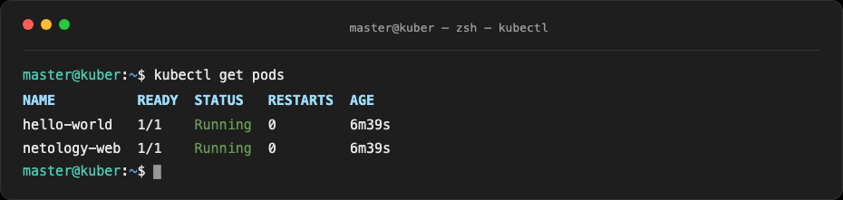
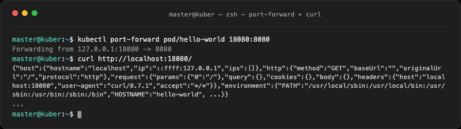
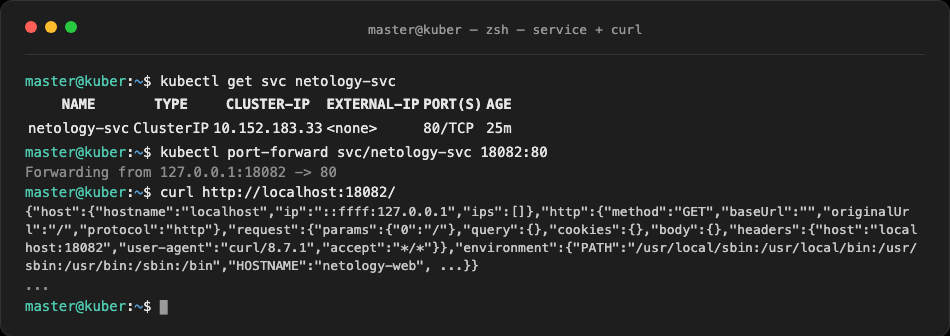

# Домашнее задание к занятию «Базовые объекты K8S» - Муравский Артем

## Задание 1. Создать Pod с именем hello-world

Манифест пода создан в файле [pod-hello-world.yaml](1.2/manifests/pod-hello-world.yaml):

```yaml
apiVersion: v1
kind: Pod
metadata:
  name: hello-world
  labels:
    app: hello-world
spec:
  containers:
    - name: echoserver
      image: ealen/echo-server:latest
      env:
        - name: PORT
          value: "8080"
      ports:
        - containerPort: 8080
```

> **Почему не тот образ.** В задании указан `gcr.io/kubernetes-e2e-test-images/echoserver:2.2`, но на ARM64 он не работает. Все проверенные версии (2.2, 2.4, 2.5) падают с ошибкой `PANIC: unprotected error in call to Lua API`: ломается встроенный nginx+LuaJIT. Вместо него взял `ealen/echo-server`, он отдаёт тот же JSON с информацией о запросе.

Применение манифеста:

```bash
kubectl --kubeconfig ~/.kube/microk8s-dashboard.yaml -n default apply -f pod-hello-world.yaml
```

Проверка состояния подов:

```
NAME           READY   STATUS    RESTARTS   AGE
hello-world    1/1     Running   0          6m39s
netology-web   1/1     Running   0          6m39s
```



Подключение к поду через port-forward и проверка ответа:

```bash
kubectl --kubeconfig ~/.kube/microk8s-dashboard.yaml -n default port-forward pod/hello-world 18080:8080
curl http://localhost:18080/
```

В ответе JSON с информацией о запросе: `hostname: hello-world`, заголовки и переменные окружения:



## Задание 2. Создать Service и подключить его к Pod

Манифесты пода и сервиса: [pod-netology-web.yaml](1.2/manifests/pod-netology-web.yaml) и [service-netology-svc.yaml](1.2/manifests/service-netology-svc.yaml).

Под `netology-web`:

```yaml
apiVersion: v1
kind: Pod
metadata:
  name: netology-web
  labels:
    app: netology-web
spec:
  containers:
    - name: echoserver
      image: ealen/echo-server:latest
      env:
        - name: PORT
          value: "8080"
      ports:
        - containerPort: 8080
```

Сервис `netology-svc` (ClusterIP, порт 80 → контейнер 8080) селектором `app: netology-web` подключается к поду `netology-web`:

```yaml
apiVersion: v1
kind: Service
metadata:
  name: netology-svc
spec:
  selector:
    app: netology-web
  ports:
    - protocol: TCP
      port: 80
      targetPort: 8080
```

Применение манифестов:

```bash
kubectl --kubeconfig ~/.kube/microk8s-dashboard.yaml -n default apply -f pod-netology-web.yaml -f service-netology-svc.yaml
```

Проверка сервиса:

```
NAME           TYPE        CLUSTER-IP      EXTERNAL-IP   PORT(S)   AGE
netology-svc   ClusterIP   10.152.183.33   <none>        80/TCP    25m
```

Подключение к сервису через port-forward и проверка ответа:

```bash
kubectl --kubeconfig ~/.kube/microk8s-dashboard.yaml -n default port-forward svc/netology-svc 18082:80
curl http://localhost:18082/
```

Ответ пришёл с пода `netology-web` (`hostname: netology-web`), значит сервис нашёл нужный под и отдал его ответ:


