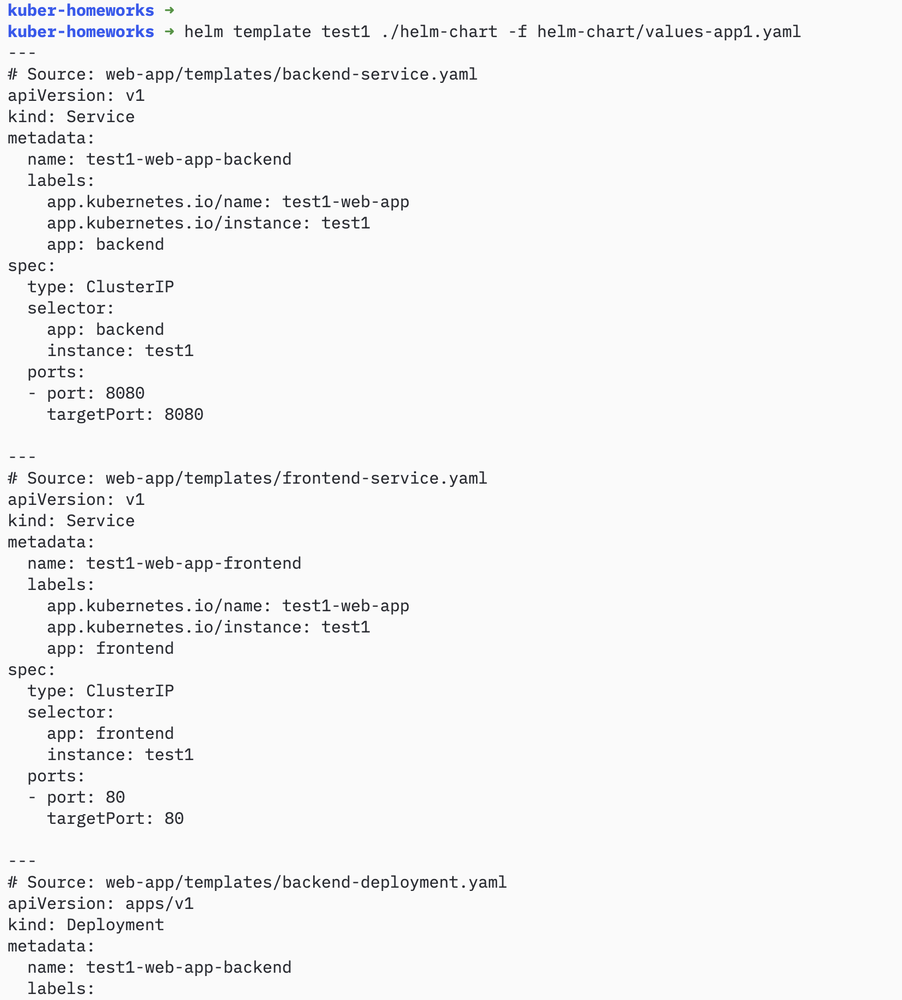
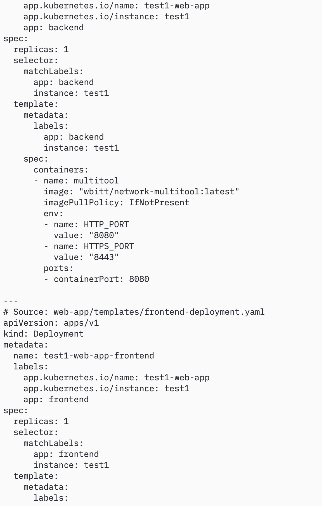

# Домашнее задание к занятию «Helm» - Муравский Артем

---

## Задание 1. Подготовить Helm-чарт для приложения

### Что было сделано

Собрано приложение в один Helm-чарт `web-app`. Внутри два компонента: фронтенд на nginx и бэкенд на multitool. Каждый компонент — отдельный Deployment со своим Service. Версия образа вынесена в переменные чарта, поэтому одно и то же приложение можно развернуть с разными версиями для разных окружений — просто поменяв одну настройку.

Чтобы несколько копий могли жить в одном неймспейсе одновременно, имена ресурсов привязаны к имени релиза (через `_helpers.tpl`). Так вторая версия не затрёт первую.

### Структура чарта

```
helm-chart/
├── Chart.yaml
├── values.yaml                  # значения по умолчанию
├── values-app1.yaml             # значения для app1
├── values-app2.yaml             # значения для app2
└── templates/
    ├── _helpers.tpl             # полное имя ресурса + лейблы
    ├── frontend-deployment.yaml # deployment nginx
    ├── backend-deployment.yaml  # deployment multitool
    ├── frontend-service.yaml    # service frontend
    └── backend-service.yaml     # service backend
```

### Проверка чарта

Перед деплоем выполнен `helm lint` — чарт валиден:

```
helm lint ./helm-chart
```


С помощью `helm template` проверено, какие манифесты сгенерируются, ещё до установки в кластер — образы и имена подхватились корректно:

```
helm template test1 ./helm-chart -f helm-chart/values-app1.yaml
```




---

## Задание 2. Запустить две версии в разных неймспейсах

### Что было сделано

Развёрнуто **три релиза** чарта в двух неймспейсах:

| Релиз    | Namespace | Frontend image | Backend image          |
|----------|-----------|----------------|------------------------|
| app1-v1  | app1      | nginx:1.27     | wbitt/network-multitool:latest |
| app1-v2  | app1      | nginx:1.26     | wbitt/network-multitool:latest |
| app2-v1  | app2      | nginx:1.25     | wbitt/network-multitool:latest |

В `app1` одновременно живут **две версии** (nginx:1.27 и nginx:1.26) — каждая отдельным релизом, без конфликтов. В `app2` — третья версия (nginx:1.25). Это и была цель задания — показать, что один чарт умеет раздавать разные версии приложения.

Неймспейсы нужны, чтобы изолировать окружения друг от друга.

### Команды

```bash
# неймспейсы
kubectl create ns app1
kubectl create ns app2

# деплой трёх релизов
helm install app1-v1 ./helm-chart -n app1 --set frontend.image.tag=1.27
helm install app1-v2 ./helm-chart -n app1 --set frontend.image.tag=1.26
helm install app2-v1 ./helm-chart -n app2 --set frontend.image.tag=1.25
```

### Результаты

**Список релизов** — все три развёрнуты и активны:

```
helm list -A
```


**Поды в кластере** — 6 подов (3 релиза × frontend+backend) в статусе `Running`:

```
kubectl get pods -A -o wide
```


**Версии образов** в deployment'ах — каждой версии свой тег фронтенда:

```
kubectl get deployments -A -o custom-columns=NAMESPACE:.metadata.namespace,DEPLOYMENT:.metadata.name,IMAGE:.spec.template.spec.containers\[0\].image
```


**Сервисы** — у каждого компонента отдельный ClusterIP Service:

```
kubectl get svc -A
```


---

## Манифесты

Полные тексты чарта находятся в папке [`helm-chart/`](helm-chart/):

- [`Chart.yaml`](helm-chart/Chart.yaml)
- [`values.yaml`](helm-chart/values.yaml)
- [`templates/frontend-deployment.yaml`](helm-chart/templates/frontend-deployment.yaml)
- [`templates/backend-deployment.yaml`](helm-chart/templates/backend-deployment.yaml)
- [`templates/frontend-service.yaml`](helm-chart/templates/frontend-service.yaml)
- [`templates/backend-service.yaml`](helm-chart/templates/backend-service.yaml)
